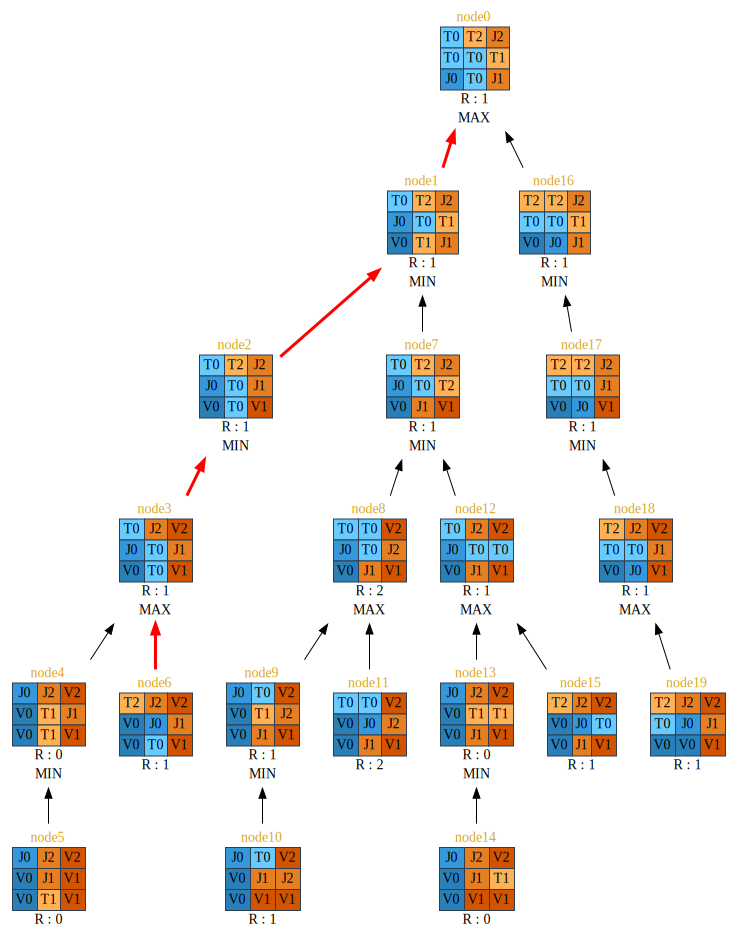

# Coalitions of artificial intelligence for the game Tron

This project was designed for a university project.


The objective of this project it's to determine if exist in configuration who an player can won against an coalition of other players.

 > This project is basically designed for a "statistical study". It is built to be run easily from a script. **There is no GUI**
 >
 > **This project is designed to run on Linux and require JavaFX.**


For this project, I implemented the Paranoid algorithm, a multiplayer variant (more than two players) of MinMax. It assumes that all players form a coalition against a single player:

```
Algorithm paranoid (ei,d)
if d = 0 then
    return f(ei)
else
    if ei is a player node then
        m ← −∞
        for all ej ∈ successors(ei) do
            m ← max(m, paranoid(ej,d−1))
        end for
    else
        m ← +∞
        for all ej ∈ successors(ei) do
            m ← min(m, paranoid(ej,d−1))
        end for
    end if
    return m
end if
```


## Build project

```
git clone https://github.com/Heziode/tron-multiplayer.git
cd tron-multiplayer
ant
```


## VM parameters

Mandatory :

- tron.coal : integer value (separated by spaces): depth of calculation of each player coalitions
- tron.nbCoal : integer value (separated by spaces): number of players in each coalition

Optional :

- tron.gridSize : integer value: grid size (square grid), by default, randomly depending on the number of players
- tron.gui : boolean, true or false: indicates whether the program should be started with or without GUI (True by default)
- tron.ptrace : boolean (false by default): true to save the paranoid calculation tree in DOT, false otherwise
- tron.player.order : integer value (separated by spaces): order of the players by coalitions (eg 0 1 0 2 = place one first of a coalition player 0, then a coalition player 1, etc.)
- tron.player.position : integer value (0 default): position (in the player list) of the first player to play.
- tron.player.shift : integer value (0 by default): shifts the location of the first player to the grid border
- tron.player.location : integer pair (separated by spaces): coordinates "x,y" of each player
- tron.result : boolean (false by default): true to save the result of the game to a file (in CSV format), false otherwise
- tron.result.name : string: name of the result file. The default is a random UUID (Universally Unique IDentifier).
- tron.random : boolean (false by default): true to enable player placement, grid size and first player to play randomly
- tron.result.print : boolean (false by default): true to display the result of the part (at the CSV foramt) in the terminal, false otherwise

Exemple : **java -jar -Dtron.gui=false -Dtron.coal="5 3" -Dtron.nbCoal="1 2" -Dtron.gridSize=7 Tron_Multiplayer.jar**

This will launch a game without graphical interface and a solo player with a depth of calculation of 5 against a coalition of 2 players with a depth of calculation of 3 on a grid of 7 by 7.


## Export results of a game in CSV format

It is possible to export the result of a game in a CSV format using the parameter:

`-Dtron.result=true`

The only separator character used is the comma: **,**

>   Results are saved only in non-GUI mode

The export format obtained is as follows (with an example of result in the second line):

| Size of the grid | Winning coalition | Number of strokes | First player index | Total number of players | Number of coalitions | Location of players at the start | Number of players per coalition | Research depth of coalitions |
| :--------------: | :---------------: | :---------------: | :----------------: | :---------------------: | :------------------: | :------------------------------: | :-----------------------------: | :--------------------------: |
|        7         |         1         |        37         |         0          |            3            |          2           |      \[0;0\] \[6;2\]\[2;6\]      |               1 2               |             5 3              |


## Export Paranoid calculation

It is possible to export in DOT language the calculations made by paranoid to each strokes using the parameter:

`-Dtron.ptrace=true`


>   It is possible to generate SVG to visualize the DOT language. This requires, on the other hand, to have the utility **dot**


You can use the **toDot.sh** script to generate them. It assumes that the files are located in a subdirectory **paranoid_traceback**.



Legend:

-   **V**: Square visited by a player
-   **J**: Square occupied by a player
-   **T**: Square belonging to the territory of a player
-   **B**: Square blocked, which is and will never be accessible during the game
-   **R**: Value of this state of games according to the player who plays at *node0*
-   **node**: the node numbers are given according to the paranoid calculation order
-   **Red arrow**: best solution found by paranoid
-   **MAX**|**MIN**: indicates whether the node takes the maximum or minimum value of its wires

## Massive execution

You can make mass executions of the program through the script contained in the script directory. 

>    Scripts is written in JavaScript and require Node.js

## License

MIT